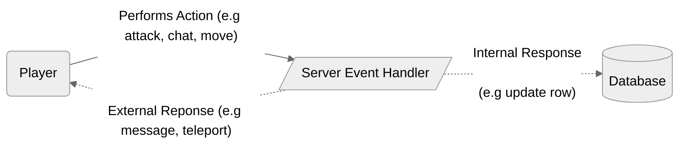
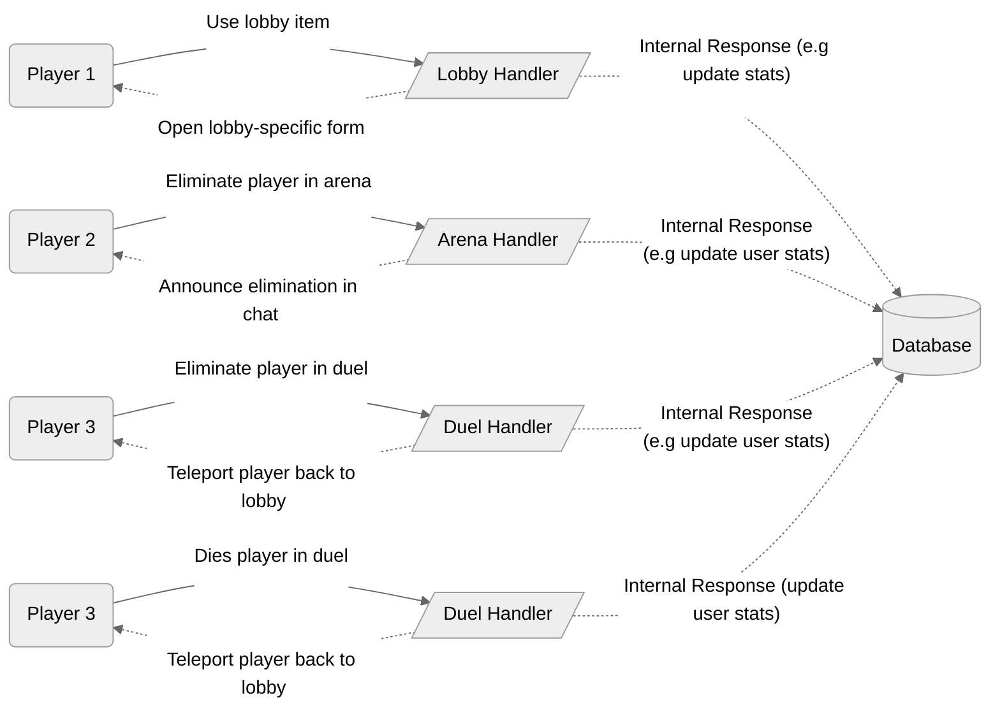

Dragonfly does not have a traditional event handling system, instead a per-player handler can be registered to handle all actions originated from said player.


If this is confusing to you, below are diagrams that may help you better you discern the differences between the typical event system you are used to in softwares like Pocketmine-MP/Nukkit and Dragonfly.

## Typical Event System (Pocketmine-MP/Nukkit)

<!--  -->

In the diagram, you can see that for every action a player does (e.g chat, move, swing, etc.), it is handled by a single global (or conglomerate of multiple) handler that does not change for every player.

Simply put, the server is just handling events from the player and there is no dynamic behavior for different handling unless its specifically branched off in your listener.

## Per-Player Event System (Dragonfly)

<!--  -->

In the diagram, you can see that there are multiple players in this example, some with different or the same handlers. Each handler is actually mounted onto the player as a field (think of making an `eventHandler` field of type `EventHandler` in Pocketmine-MP/Nukkit) and runs each event of the handler in it's own Go routine (green thread).

This system brings in more modularity to your code, as you can design handlers to your own liking and decoupling logic away from larger handlers. A downside to this system is that it makes it more difficult to utilize reusable or global event-handler code, however, these have solutions that we will talk about in a later section.

Overall, the main takeaway you should understand is that event handlers are mounted on the player instance itself, so you will be able to change the handler at any point in the server life-cycle to fit the need of whatever your player is doing, consider the follow Go pseudocode:
```go
func onPlayerJoin(p *player.Player) {
    data.Intialize(p)

    p.Handle(lobby.NewHandler(p))
}

func onArenaJoin(p *player.Player, ar *ffa.Arena) {
    // Note: The player is still using the lobby handler, so we change it.
    ar.Add(p)
    ar.Handle(ffa.NewHandler(p))
}

func onPlayerDeath(p *player.Player) {
    // We can use type-checks to see what kind of handler the player has
    if h, ok := p.Handler().(*ffa.Handler); ok {
        // Add player to lobby, then switch to lobby handler
        lobby.Add(p)
        p.Handle(lobby.NewHandler(p))
    }
}
```